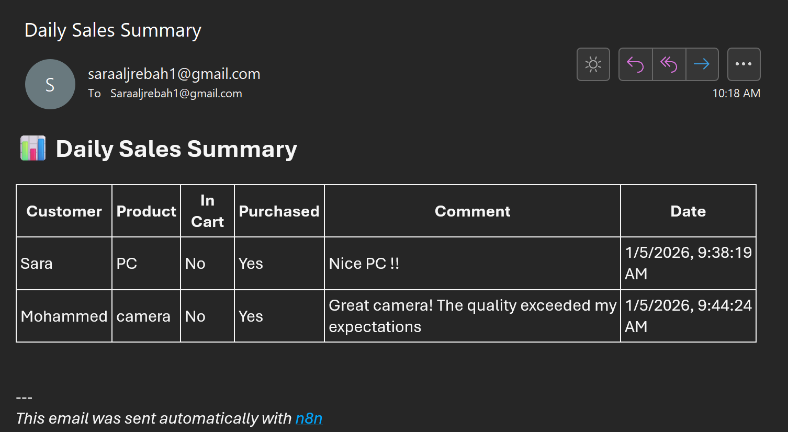

# 🧾 Sales Automation with n8n

n8n-sales-tracker is a simple sales tracking and automation project built using **n8n**, **Google Sheets**, and **Email automation**.

It collects sales data from a form, stores it in Google Sheets, and sends a **daily sales summary email automatically at 9:00 AM**.

---

## 🚀 Features

- 📋 Capture sales data via form submission
- 📊 Store sales records in Google Sheets
- ⏰ Daily scheduled email summary (9 AM)
- 📧 Clean HTML email with a sales table
- ⚡ Built with n8n 

---

## 🛠️ Tech Stack

- **n8n**
- **Google Sheets**
- **Email (Gmail)**
- **HTML (for email formatting)**

---

## 🔄 Workflows Overview

### 1️⃣ Sales Form → Google Sheets
This workflow listens to form submissions and appends the data directly to Google Sheets.

---

### 2️⃣ Daily Sales Email Automation
This workflow runs every day at **9:00 AM**, reads sales data from Google Sheets, formats it using HTML, and sends a summary email.

---

## 📧 Email Preview

Here’s an example of the automated daily sales email:

---

## 📌 Sample Data Structure

| Customer | Product | In Cart | Purchased | Comment | Date |
|--------|--------|--------|----------|---------|------|
| Sara | PC | No | Yes | Nice PC !! | 2026-01-05 |
| Mohammed | Camera | No | Yes | Great quality | 2026-01-05 |

---

## 💡 Notes

- The workflow can be easily extended to:
  - Filter only purchased items
  - Add totals and statistics
  - Send notifications via Telegram or Slack

---

## ✨ Author

Built by **Sara Aljuraybah**

---

## 📎 License

This project is for learning.
